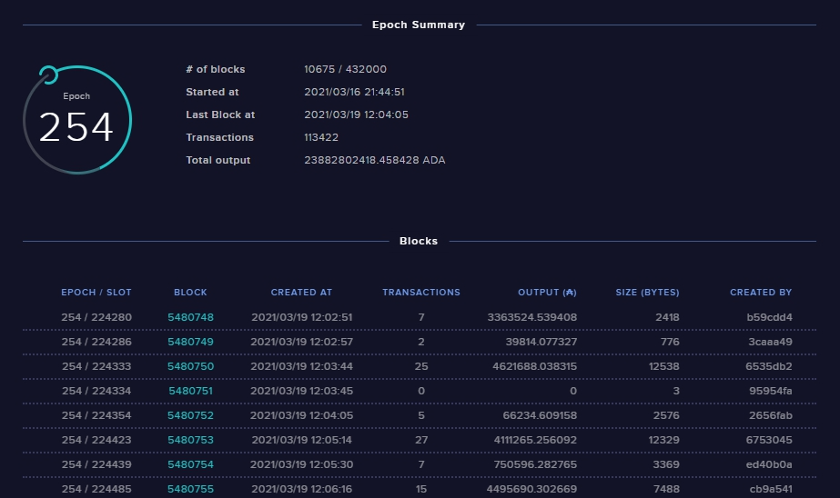
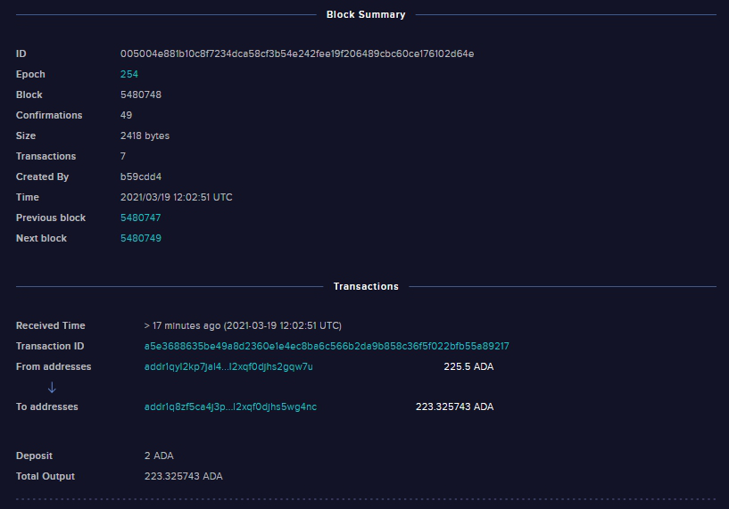

## Cardano tracking tools

Since Cardano is a public blockchain ledger, it is possible to easily track all recent transactions, block details, and epoch data using different tools.

### Exploring transactions and blocks

**Cardano Explorer**

[Cardano Explorer](https://explorer.cardano.org/en) is a user-oriented tool that fetches data from the main database and reflects it in a straightforward and convenient web interface.

The Explorer shows the latest epoch details. You can click the latest epoch and see:

-   a number of blocks produced during this epoch
-   time the epoch started
-   time of last produced block
-   number of processed transactions
-   total output in ada
    

Figure 1. Latest epoch summary

By choosing a specific block, you can explore it in more detail to see its ID, size, epoch and block details, number of included transactions and confirmations:

Figure 2. Block summary

You can also search for specific epochs, transactions or blocks by pasting their IDs in the search field.

Here is a list of other explorers to consider:

-   [AdaEx](https://adaex.org/)
-   [Adatools](https://adatools.io/transactions)
-   [Cardanoscan](https://cardanoscan.io/transactions)
-   [AdaStat](https://adastat.net/transactions)

### Exploring assets

Cardano supports multi-asset creation and management. To see a list of created assets and tokens, you can use these tools:

-   [Cardano Assets](https://cardanoassets.com/)
-   [AdaStat (tokens)](https://adastat.net/tokens)
-   [Adatools (tokens)](https://adatools.io/tokens)
-   [Cardanoscan (tokens)](https://cardanoscan.io/tokens)

### Exploring stake pools

To find a list of all registered stake pools, their tickers, pool names, and IDs, you can use these tools:

-   [Cardano PoolTool](https://pooltool.io/)
-   [ADAtainment](https://www.adatainment.com/index.php?page=home&lang=en)
-   [POOLSTATS](https://poolstats.org/#)
-   [Adatools (pools)](https://adatools.io/pools)
-   [Cardanoscan (pools)](https://cardanoscan.io/pools)
    
> Note: IOHK has developed a [stake pool metadata aggregation server](https://docs.cardano.org/en/latest/getting-started/stake-pool-operators/SMASH-metadata-management.html) (SMASH) to provide the community with a list of verified stake pools with valid metadata. Smash is integrated with the Daedalus wallet, and users can see a list of valid stake pools in the delegation center tab.
