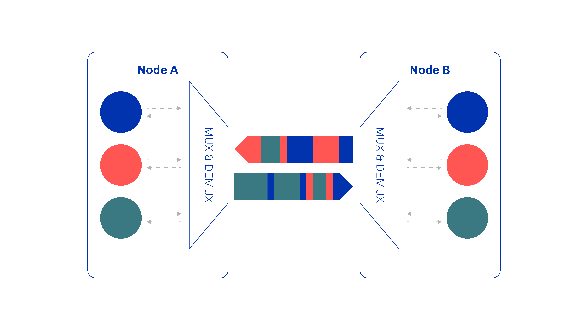
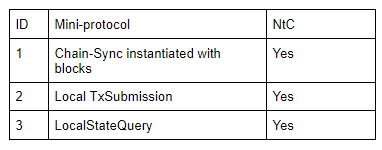

## Connection management

Transmission Control Protocols (TCP) and Internet Protocols (IP) form a protocol suite universally deployed on the network. TCP/IP enables a reliable bidirectional communication channel between systems on the internet.

The ordered delivery of **<a href="#protocols">Cardano node communication protocols</a>** is guaranteed by the TCP/IP protocol.

Operating systems limit the number of concurrent connections. By default, Linux, for example, can open 1,024 connections per process, whereas macOS limits this number to 256. To avoid excessive use of resources and enable reliable means for connection establishment, Cardano uses a *multiplexer*.

### Connection management features

The [network layer](https://docs.cardano.org/en/latest/explore-cardano/cardano-network.html) handles a range of specific tasks besides the exchange of block and transaction information required by the Ouroboros protocol.

Generally, connection management implementation includes the performance of the following tasks:

-   opening a socket and/or acquiring resources from the OS
-   negotiating the protocol version with the [handshake mini-protocol](https://docs.cardano.org/en/latest/explore-cardano/cardano-network.html#handshake-mini-protocol)
-   spawning the thread that runs the multiplexer (which can be instructed to start/stop various mini-protocols)
-   discovering and classifying exceptions thrown by mini-protocols or the multiplexer itself
-   shutting down the connection in case of an error
-   handling a shutdown request from the peer
-   shutting down the threads that run mini-protocols
-   closing a socket

### Multiplexing

The multiplexing layer acts as a central crossing between mini-protocols and the network channel. It runs several [mini-protocols](https://docs.cardano.org/en/latest/explore-cardano/cardano-network.html#example-mini-protocols) in parallel in a single channel ‒ TCP connection, for example.

Figure 1 reflects how data flows between two nodes, each running three mini-protocols using a multiplexer (MUX) and a de-multiplexer (DEMUX).

Figure 1. Data flow between the nodes through multiplexing

Data transmitted between nodes passes through the MUX/DEMUX of the nodes. There is a fixed pairing of mini-protocol instances, which means that each instance only communicates with its dual instance (an initiator and a responder side).

The implementation of the mini-protocol also handles serialization and de-serialization of its messages. Mini-protocols write chunks of bytes to the MUX and read chunks of bytes from the DEMUX. The MUX reads the data from mini-protocols, splits it into segments, adds a segment header, and transmits the segments to the DEMUX of its peer. The DEMUX uses the segment’s headers to reassemble byte streams for the mini-protocols on its side. The multiplexing protocol (see the note below) itself is completely agnostic to the structure of the multiplexed data.

> Note: This is not a generic, but specialized, use of multiplexing. Individual mini-protocols have strict constraints on unacknowledged messages that can be in flight. The design avoids the conditions in which the use of general TCP over TCP multiplexing creates chaotic performance.

### Data segments of the multiplexing protocol

Multiplexing data segments include the following details:

-   **Transmission time** ‒ a timestamp based on the lower 32 bits of the sender’s monotonic clock with a resolution of one microsecond.
-   **Mini-protocol ID** ‒ the unique ID of the mini-protocol.
-   **Payload length** ‒ the size of the segment payload in bytes. The maximum payload length supported by the multiplexing wire format is 216 − 1. Note that an instance of the protocol can choose a smaller limit for the size of segments it transmits.
-   **Mode** ‒ the single bit M (the mode) is used to distinguish the dual instances of a mini-protocol. The mode is set to 0 in segments from the initiator (the side that initially has agency), and it is set to 1 in segments from the responder.

### <a name="protocols">Cardano node communication protocols</a>

Cardano uses inter-process communication (IPC) protocols to allow for the exchange of blocks and transactions between nodes, and to allow local applications to interact with the blockchain via the node.

#### Node-to-Node IPC overview

The Node-to-Node (NtN) protocol transfers transactions between full nodes. NtN includes three mini-protocols (chain-sync, block-fetch, and tx-submission), which are multiplexed over a single TCP channel using a network-mux package.

The following diagram represents the NtN operational flow:

NtN follows a pull-based strategy, where the initiator node queries for new transactions and the responder node replies with the transactions if any exist. This protocol perfectly suits a trustless setting where both sides need to be protected against resource consumption attacks from the other side.

**NtN mini-protocols explained**

A brief explanation of the NtN mini-protocols:

-   **chain-sync**: a protocol that allows a node to reconstruct a chain of an upstream node
-   **block-fetch**: a protocol that allows a node to download block bodies from various peers
-   **tx-submission**: a protocol that allows submission of transactions. The implementation of this protocol is based on a generic mini protocol framework, with one peculiarity: the roles of the initiator and the responder are reversed. The Server is the initiator that asks for new transactions, and the Client is the responder that replies with the transactions. This role reversal was designed thus for technical reasons.

#### Node-to-Client IPC overview

Node-to-Client (NtC) is a connection between a full node and a client that consumes data but does not take part in the Ouroboros protocol (a wallet, for example.)

The purpose of the NtC IPC protocol is to allow local applications to interact with the blockchain via the node. This includes applications such as wallet backends or blockchain explorers. The NtC protocol enables these applications to access the raw chain data and to query the current ledger state, and it also provides the ability to submit new transactions to the system.

The NtC protocol uses the same design as the Node-to-Node (NtN) protocol, but with a different set of mini-protocols, and using local pipes rather than TCP connections. As such, it is a relatively low-level and narrow interface that exposes only what the node can provide natively. For example, the node provides access to all the raw chain data but does not provide a way to query data on the chain. The job of providing data services and more convenient higher-level APIs is delegated to dedicated clients, such as cardano-db-sync and the wallet backend.

**NtC mini-protocols**

The NtC protocol consists of three mini-protocols:

-   **chain-sync** - used for following the chain and getting blocks
-   **local-tx-submission** - used for submitting transactions
-   **local-state-query** - used for querying the ledger state
   
The NtC version of chain-sync uses full blocks, rather than just block headers. This is why no separate block-fetch protocol is needed. The local-tx-submission protocol is like the NtN tx-submission protocol but simpler, and it returns the details of transaction validation failures. The local-state-query protocol provides query access to the current ledger state, which contains a lot of interesting data that is not directly reflected on the chain itself.

**How NtC works**

In NtC, the node runs the producer side of the chain-sync protocol only, and the client runs the consumer side only.

This table shows which mini-protocols are enabled for NtC communication:

