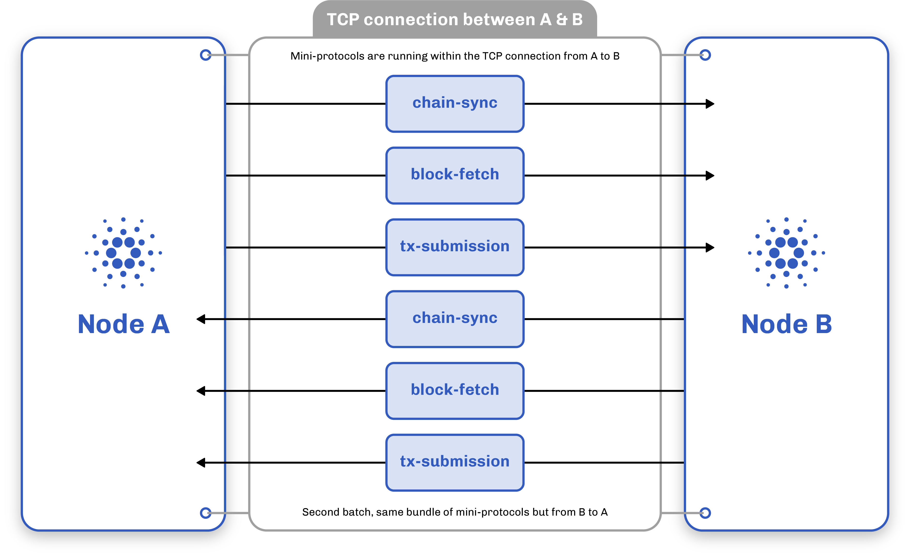

## Node-to-Node IPC

This section provides a detailed overview of the Node-to-Node IPC.

### Node-to-Node IPC Overview

The Node-to-Node (NtN) protocol transfers transactions between *full* nodes. 

NtN includes three mini-protocols (**chain-sync**, **block-fetch** and **tx-submission**), which are multiplexed over a single bearer (e.g., a TCP socket) using a network-mux package.

The following diagram represents the NtN operational flow

NtN follows a pull-based strategy, where the initiator node queries for new transactions and the responder node replies with the transactions, if any exist. This protocol perfectly suits a trustless setting where both sides need to be protected against resource consumption attacks from the other side.

### NtN mini-protocols Explained

A brief explanation of the NtN mini-protocols:

* chain-sync: a protocol that allows a node to reconstruct a chain of an upstream node
* block-fetch: a protocol that allows a node to download block bodies from various peers
* tx-submission: a protocol that allows submission of transactions.The implementation of this protocol is based on a generic mini protocol framework, with one peculiarity: the roles of the initiator and the responder are reversed. The Server is the initiator that asks for new transactions, and the Client is the responder that replies with the transactions. This role reversal was designed thus for technical reasons.

