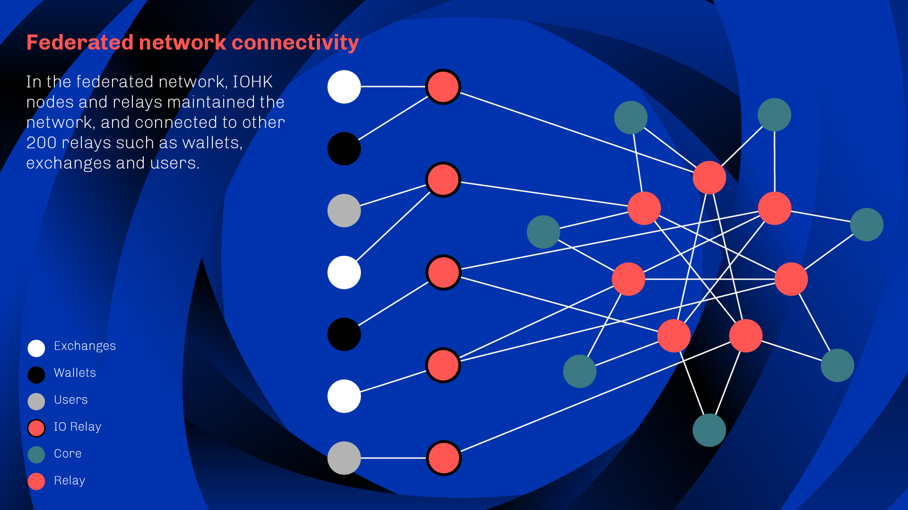
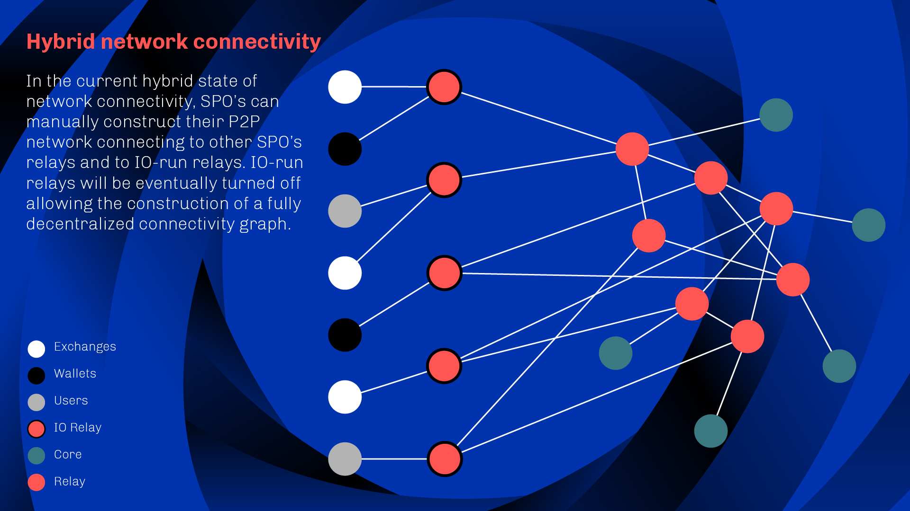
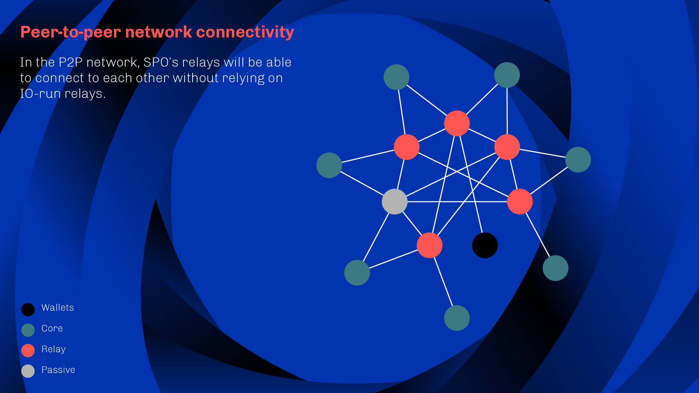
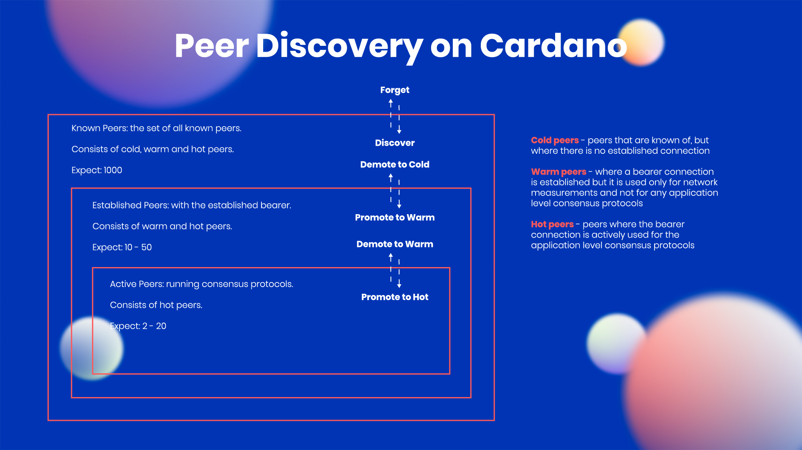

## Peer-to-peer networking

Cardano nodes and the interactions between them are combined together within a networking layer, which distributes information about transactions and block creation among all active nodes. In this way, the system validates and adds blocks to the chain and also verifies transactions. A distributed network of nodes must keep communication delays to a minimum, and be resilient enough to cope with failures or capacity constraints.

In the Byron federated system, nodes were connected by a static configuration that was defined in a topology file. Since the introduction of Shelley, the system has been functioning in a hybrid mode. Moving from the federated state of network connectivity to the hybrid one, we added a manually constructed peer-to-peer (P2P) network of stake pool operator (SPO) relay nodes. This means that SPO core nodes can connect to both federated relay nodes and to other SPO-run relay nodes. This connectivity is not automated, however, it enables the exchange of block and transaction information without relying on federated nodes. During this stage, federated relay nodes are being gradually turned off so that SPOs can connect to each other’s relays. 

To ensure efficient communication between nodes, it is essential to enable automated connections of SPO relays to each other, so that less static configuration is needed. This is currently being accomplished through upgrades to the network stack, which will ultimately enable a full P2P topology for all Cardano nodes. P2P communication will enhance the flow of information between nodes, thus reducing (and ultimately removing) the network’s reliance on the federated nodes, and enabling complete decentralization of the Cardano network.

> **Note**: The P2P deployment is currently in testing stages. The team is focused on the delivery of final features for SPOs and the preparation of QuickCheck simulation tests. The full P2P deployment will happen later in 2021. This documentation describes the P2P functionality for information purposes only ahead of this release.

### P2P capabilities

The network stack undergoes a number of improvements to achieve the desired network resilience. These improvements do not require a protocol change, but rather enable automated peer selection and communication between peers and nodes.

The P2P networking is enabled due to the use of the following components:

+ **P2P governor** ‒ manages the automatic initiation of connections between peers. 
+ **Connection manager** ‒  integrates with the P2P governor to monitor new connections and protocols, which ensures efficient communication and improved issue tracking.
+ **Server** ‒ accepts connections and limits dynamic rates synchronizing these with the connection manager. 
+ **Inbound protocol governor** ‒ receives data from the connection manager to start or restart responder mini-protocols on inbound and outbound duplex connections.

Next, we take a closer look at how the P2P governor works to ensure automated connectivity between peer nodes on the network. 

### P2P governor functionality

The Cardano network consists of multiple peer nodes. Some peer nodes are more active than others, some have established connections, and some should be promoted to ensure the best system performance. Each block-producing node maintains a set of peers mapped into three categories:

+ **cold peers** ‒ existing peers without an established network connection
+ **warm peers** ‒ peers with an established bearer connection, which is only used for network measurements without implementing any of the node-to-node mini-protocols. 
+ **hot peers** ‒ peers that have a connection, which is being used by all three node-to-node mini-protocols

Newly discovered peers are initially added to the cold peer set. The P2P governor is then responsible for peer connection management: it defines which peers are beneficial for connection purposes, and which should be promoted or demoted between cold, warm, or hot sets. 

The primary goal of the P2P governor is to maintain the target number of cold, warm, and hot peers. This builds and maintains a connectivity map of the entire network, and simplifies the process of connection definitions by handling them automatically. 

To establish connectivity between nodes, the P2P governor engages in the following activities:

+ the random gossip used to discover a higher number of cold peers
+ promotion of cold peers to warm peers
+ demotion of warm peers to cold peers
+ promotion of warm peers to hot peers
+ demotion of hot peers to warm peers

The P2P governor needs to establish and maintain:

+ a target number of cold peers (for example, 100)
+ a target number of hot peers (for example, between 2–20)
+ a target number of warm peers (for example, between 10–50)
+ a set of warm peers that are sufficiently diverse in terms of hop distance and geographic locations
+ a target churn frequency for hot or warm changes
+ a target churn frequency for warm or cold changes
+ a target churn frequency for cold or unknown changes

Using 2–20 hot peers is cost-efficient, as peers exchange only their block headers. The block body, in turn, is typically requested only once, and it tends to follow the shortest path through the connectivity graph. 

The purpose of warm peers is to provide access to those peers that can be quickly promoted to hot ones (in case any of the warm peers fail), and also provide candidates for the churn of hot peers. 

The policy for selecting which warm peers to promote to hot relies on the upstream measurements. The purpose of a degree of churn between cold and warm peers is, in part, to discover the network distance between more peers and to allow potentially better warm peers to take over from existing hot peers. This enables further optimization and adjustments. Maintaining diversity in hop distances contributes to better block distribution times across the globally distributed network. 

Overall, this approach follows a common pattern for probabilistic search or optimization that uses a balance of local optimization with some elements of higher-order disruption to avoid becoming trapped in a poor local optimum.

Peers maintain a limited set of information, which is based on their previous direct interactions. Cold peers, for instance, may not maintain any data, as they have not established interactions yet. Such data can be compared to ‘reputation’ property, however, these details are purely local and are not shared among other nodes.  Local peer reputation information is also updated when peer connections fail. The network does not maintain negative peer information for extended periods of time: to bound resources and because of the simplicity of [Sybil attacks](https://iohk.io/en/blog/posts/2018/10/29/preventing-sybil-attacks/).

The implementation classifies exceptions that cause connection failures into three classes:

+ internal node exceptions (for example, local disk corruption)
+ network failures (for example, dropped TCP connections) 
+ adversarial behavior (for example, a protocol violation detected by the typed-protocols layer or by the consensus layer).

In the case of adversarial behavior, the peer can be immediately demoted from the hot, warm, or cold sets. 
