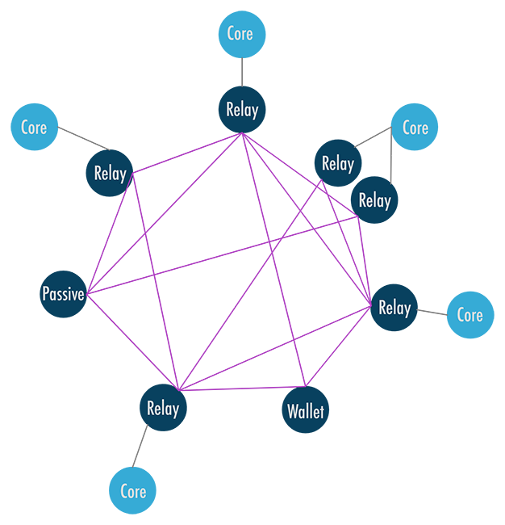

## Establishing connectivity between the nodes

Nodes connect to each other within the Cardano networking layer, and this connection is essential for information exchange about transactions and new block creation.

### Cardano networking

With Byron, federated nodes were wholly responsible for managing block production and network connections. The Byron network consisted of a set of federated core nodes - static nodes that produced blocks and maintained the Cardano network. With the launch of Shelley, the network runs in a hybrid mode with federated nodes operated by IOG (which configure connections between different stake pool operators) and nodes operated by the SPO community. The percentage of blocks produced by decentralized nodes is constantly growing while federated nodes gradually stop operating, which evenly spreads the network maintenance across all the stake pool operators. Over the lifetime of the Shelley system, the network will transition into full decentralization using continuous automatic discovery and selection of peers.

During the initial phase, nodes connect to other nodes by means of a static configuration, defined in a topology file. To avoid a situation when relay nodes go offline, which causes the block-producing nodes to be inaccessible, it is crucial to connect to reliable relay nodes. Currently, IOG offers [a list of all registered relays categorized by geographical location](https://explorer.cardano-mainnet.iohk.io/relays/topology.json) for SPOs to consider for connection purposes. It is also recommended that SPOs generate a configuration that uses 20 other SPOs as peers. In practice, many SPOs can use more than 20 peers for connection purposes. The list allows to select peers that are both nearby and far away so that there is strong inter-region connectivity.

Before the network is moved from federated to fully decentralized, the node’s network layer will be switched to use continuous automatic discovery and peer selection. This will be achieved through upgrades to the network stack. Initially, this will enable improved automation of connecting SPO relays to each other so that less static configuration is needed. Ultimately it will enable a full peer-to-peer (P2P) topology for all Cardano nodes, which will make the network less reliant on IOG-run relays.

Please follow this link to read more about the [Cardano network](https://docs.cardano.org/en/latest/explore-cardano/cardano-network.html), communication between the nodes, and mini-protocols that enable this functionality.

### Connecting core and relay nodes

As a stake pool operator, you will have two types of nodes: core nodes and relay nodes. Each core node must be accompanied by one or more relay nodes.

The difference between the two types is that core nodes are responsible for producing blocks, while relays are responsible for communicating with other relays in the network and broadcasting blocks. This difference determines how they are configured and how they are connected to the network.

A core node is configured with various key-pairs and an operational certificate needed for block generation. It only connects to its relay nodes.

>Instructions to configure a node and create an operational certificate:
>-   [About node configuration files](https://docs.cardano.org/projects/cardano-node/en/latest/getting-started/understanding-config-files.html)  
>-   [Configuring topology files for block-producing and relay nodes](https://docs.cardano.org/projects/cardano-node/en/latest/stake-pool-operations/core_relay.html)
>-   [Creating an operational certificate with key evolving signature (KES)](https://docs.cardano.org/projects/cardano-node/en/latest/stake-pool-operations/KES_period.html)

>Further reading:
>-   Creating keys and operational certificates

A relay node doesn’t need any keys and will therefore be unable to produce blocks. It is connected to its core node, other relays, and external nodes.

Each node should run on a dedicated server, and the core node server’s firewall should be configured to only allow incoming connections from its relays.

 
