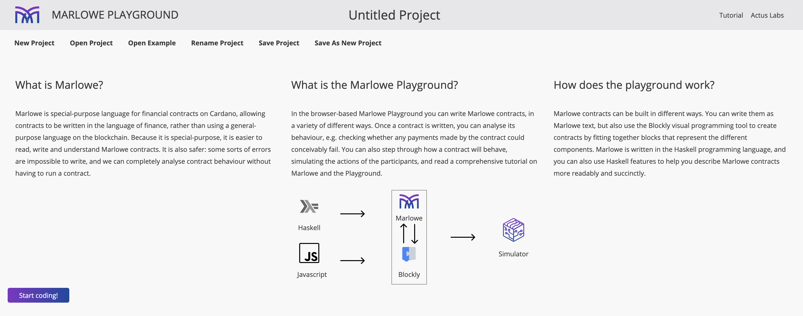
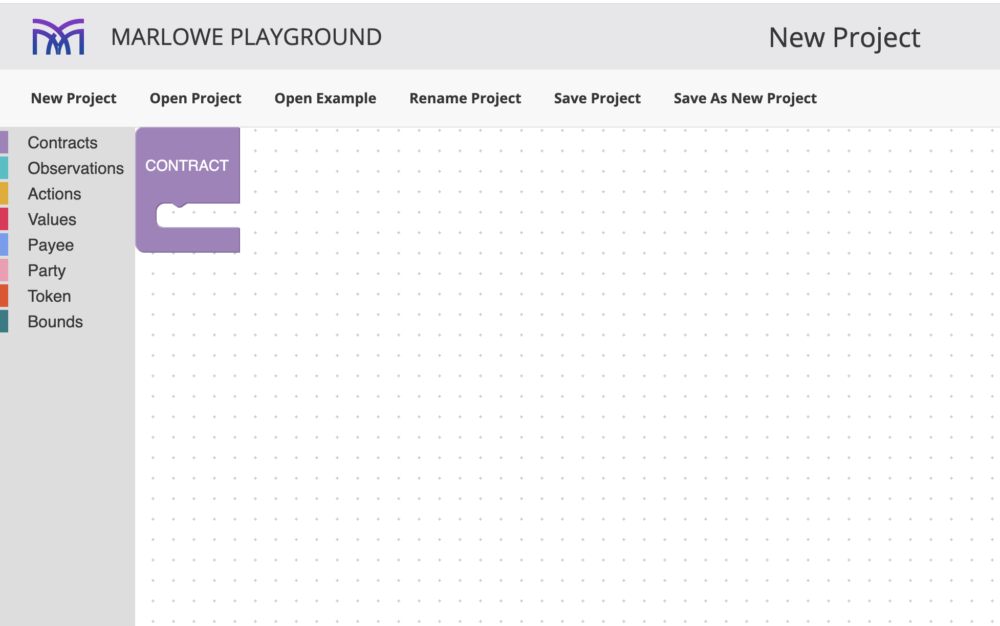
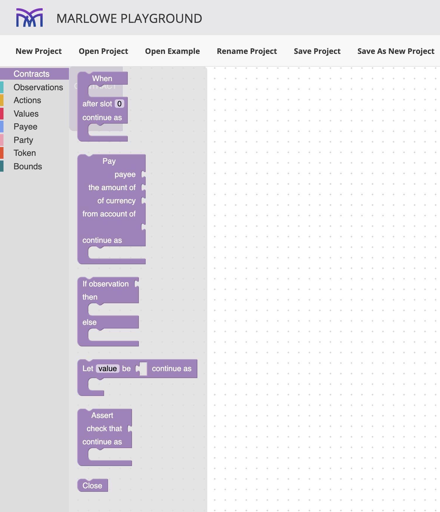
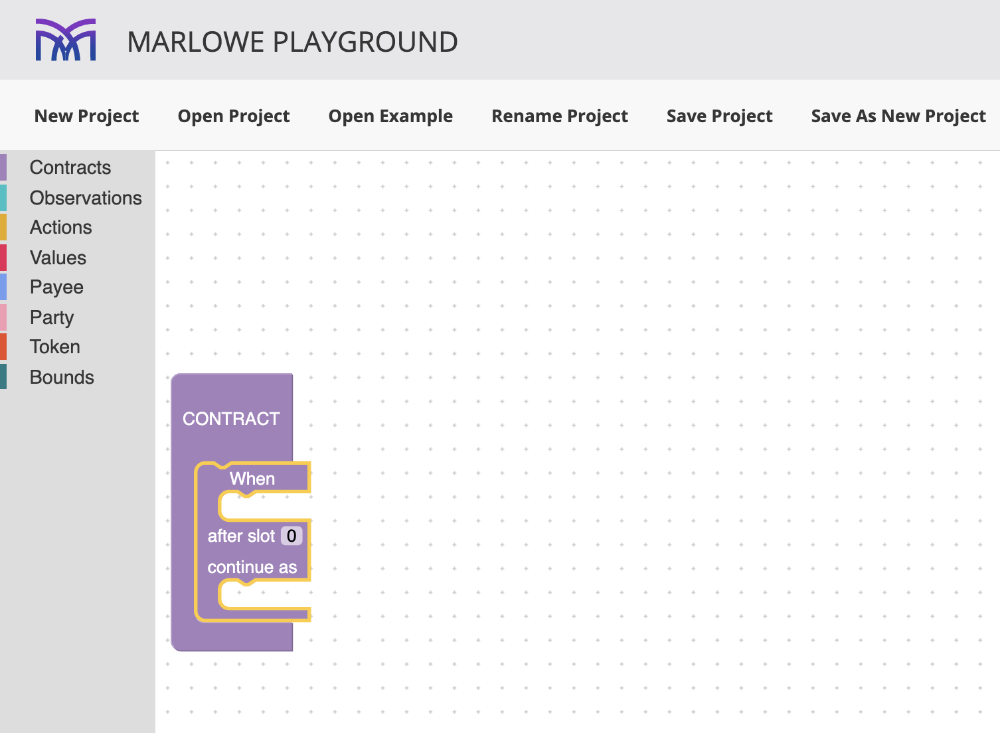
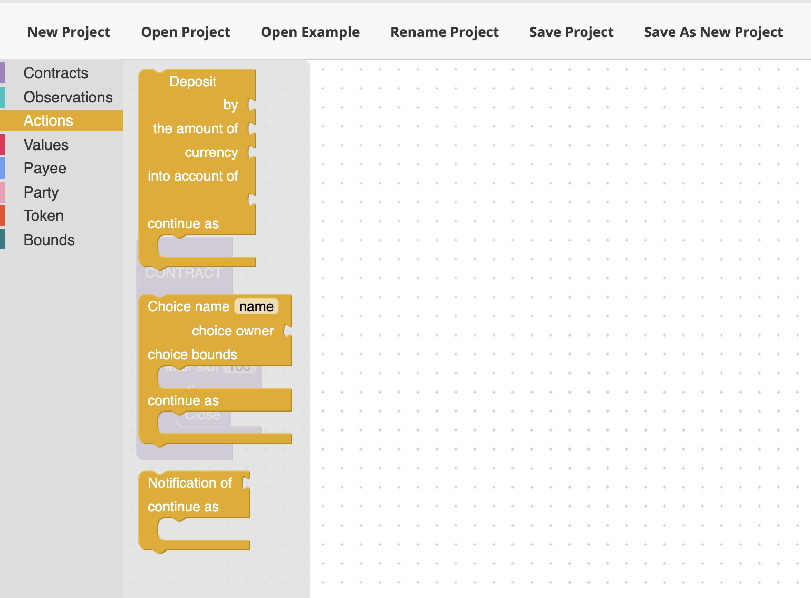
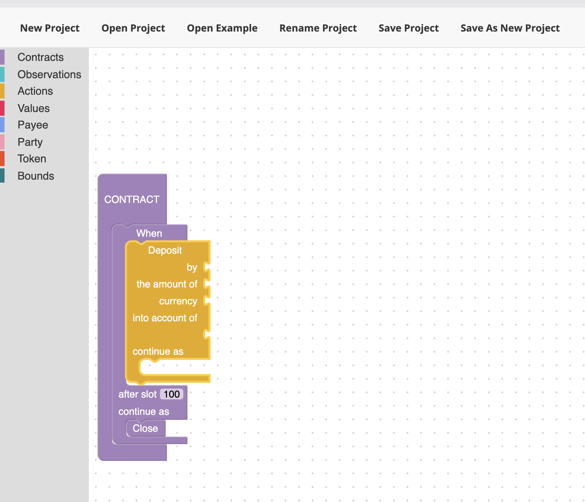
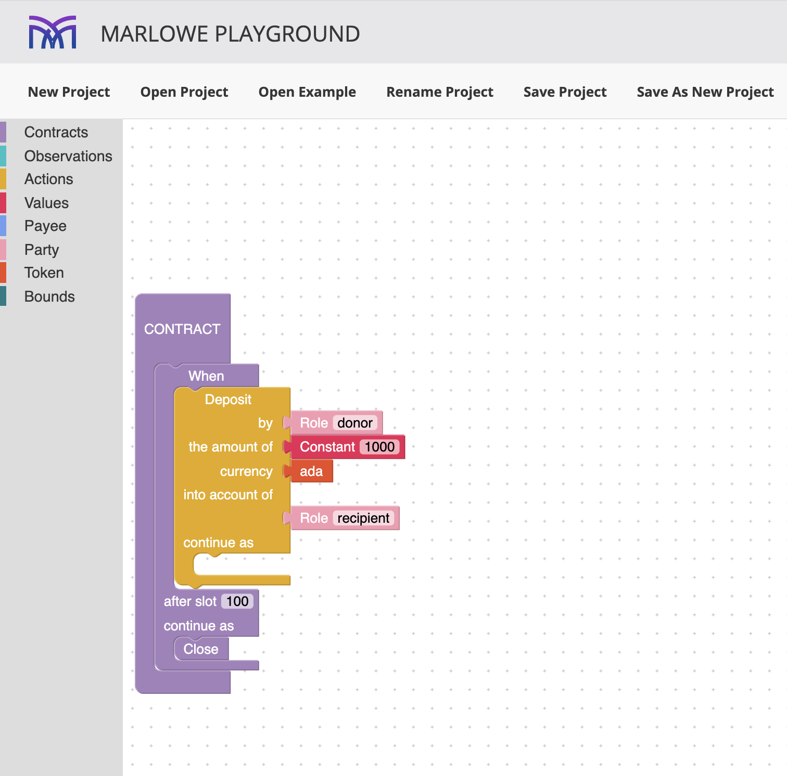
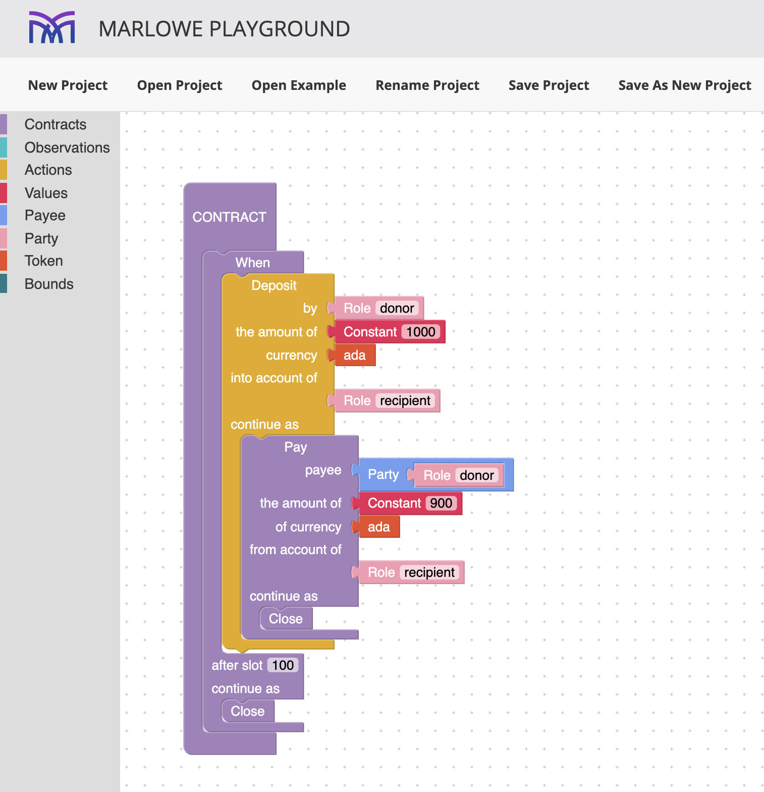

## Writing Marlowe with Blockly 
You can write Marlowe code directly as Marlowe text, or alternatively use the Blockly visual interface to piece together the parts of the contract. This is a very useful tool for those users who may not have experience in programming editors, and want to build the contracts visually.

To use Blockly follow these steps:
1. Open the [Marlowe Playground](https://alpha.marlowe.iohkdev.io/#/).

    You will see a window like this:

2. Click the **Start coding!** button on the bottom left and then select **Blockly** from the menu.

    You will see a window like this:

3. You can build contracts by adding components to the *Contract* block. You will see a list of options for forming a contract by clicking **Contracts** in the menu. 

4. Click **Contracts** and select a block. 
5. Drag it into the building pane and then fit it into the top-level slot. 

   The following example shows how to construct a contract starting with `When` as its main construct.

    
6. Continue building the contract. To build a contract with `When`, it needs to include one or more actions that trigger the contract. These can be chosen from the **Actions** menu item.

 
   The following example shows how to construct a *Deposit* action and fit it into the first gap in the contract that you are building.

7. Next, insert the following information:
 
   - who is making the deposit (the party)
   - the value and currency (token) of the deposit
   - whose account it should be deposited to (the recipient).
   

8. You can add other actions. For this, choose actions, add them, and fill out information. Respective action will require different types of information.  Add the *Close* tab after *Continue as* so that the contract closes after making the deposit. 

9. Finally, when all actions are inserted and conditions are added, you can complete your contract by adding a *Close* tab to the main contract. This shows how the contract should behave in case the deposit is not made before the specified timeout. 

